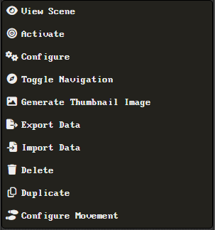

<!--- Downloads @ Latest Badge -->
<!--- replace <user>/<repo> with your username/repository -->
<!---  -->

<!--- Forge Bazaar Install % Badge -->
<!--- replace <your-module-name> with the `name` in your manifest -->
<!---  -->

# FoundryVTT Module

Adds additional scene settings to control the movement of tokens in the scene.

## How to Use this Module

When activated, the module adds a new option in the scene context menu. Right-click the scene you want to configure and select the `Configure Movement` option to open the configuration dialog.

## Supported Settings

- Block Mouse Click/Drag Token Movement
  - Prevents users from dragging tokens in the scene, requires the use of arrow keys to move.
- Allow Mouse Click/Drag Token Movement in Combat
  - If 'Block Mouse Click/Drag Token Movement' is enabled, this will allow players to drag tokens during combat.
- Gridless Movement Modifier
  - Allows modifying the size of each arrow key movement step in a gridless scene. By default Foundry will move tokens Zpx away for each arrow key input (where Z is the grid scale). This modifier acts as a multiplier for the step distance, so a modifier of `0.5` will cut the distance moved in half.

## Changelog
